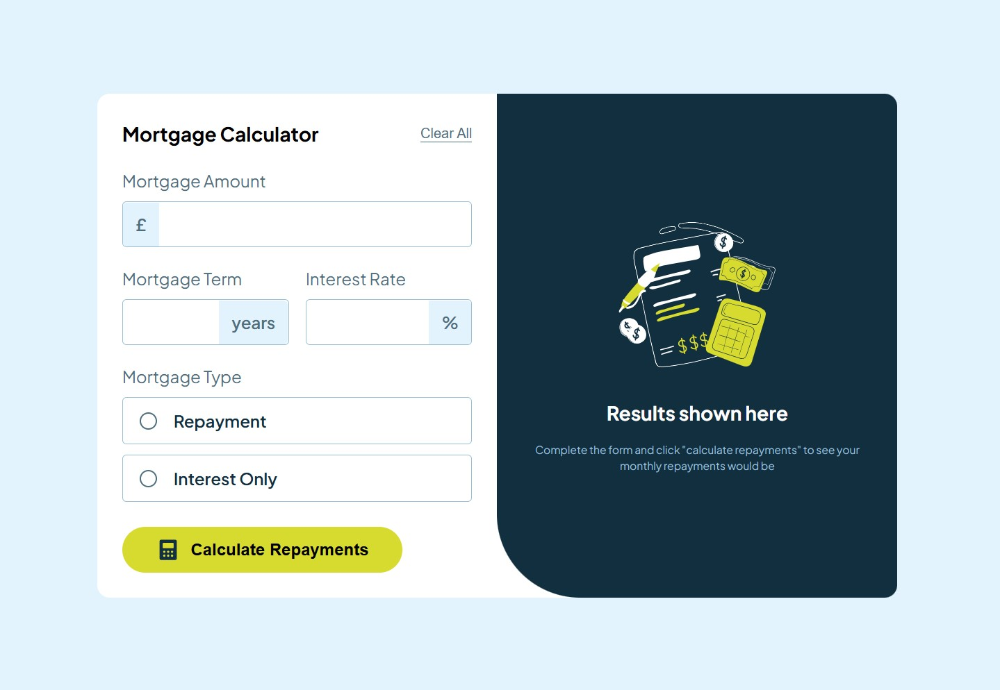

# Frontend Mentor - Mortgage repayment calculator solution

This is a solution to the [Mortgage repayment calculator challenge on Frontend Mentor](https://www.frontendmentor.io/challenges/mortgage-repayment-calculator-Galx1LXK73). Frontend Mentor challenges help you improve your coding skills by building realistic projects. 

## Table of contents

- [Overview](#overview)
  - [The challenge](#the-challenge)
  - [Screenshot](#screenshot)
  - [Links](#links)
- [My process](#my-process)
  - [Built with](#built-with)
  - [What I learned](#what-i-learned)
  - [Continued development](#continued-development)
  - [Useful resources](#useful-resources)
- [Author](#author)
- [Acknowledgments](#acknowledgments)

## Overview

### The challenge

Users should be able to:

- Input mortgage information and see monthly repayment and total repayment amounts after submitting the form
- See form validation messages if any field is incomplete
- Complete the form only using their keyboard
- View the optimal layout for the interface depending on their device's screen size
- See hover and focus states for all interactive elements on the page

### Screenshot



### Links

- Solution URL: [My URL](https://your-solution-url.com)
- Live Site URL: [My Site](https://aiy7788.github.io/mortgage-repayment-calculator/)

## My process

### Built with

- Semantic HTML5
- CSS custom properties (variables)
- Flexbox & CSS Grid
- Mobile-first workflow
- Vanilla JavaScript (ES6) for logic and DOM manipulation
- Form validation and dynamic number formatting with commas

### What I learned

Format numbers dynamically while typing using toLocaleString() and cursor adjustment.
Handle different mortgage types (Repayment vs Interest Only) with clear calculation formulas.
Manage validation states and display error messages with smooth UX.
Use CSS Grid effectively to keep layouts responsive across devices.

Example JS snippet for cursor handling during number formatting:

```js
const oldCommas = (rawValue.slice(0, cursorPosition).match(/,/g) || []).length;
const newCommas = (formatted.slice(0, cursorPosition).match(/,/g) || []).length;
const diff = newCommas - oldCommas;
const newCursor = cursorPosition + diff;
e.target.setSelectionRange(newCursor, newCursor);

```
This keeps the cursor position stable when commas are inserted dynamically.

### Continued development

In future projects, I want to:

- Convert this project to React for better component structure
- Implement dark/light themes
- Add amortization charts using a chart library (like Chart.js or Recharts)

### Useful resources

- [MDN Web Docs](omhttps://www.example.chttps://developer.mozilla.org/en-US/docs/Web/JavaScript/Reference/Global_Objects/Number/toLocaleString) - This helped me for format numbers
- [Frontend Mentor Community](https://www.frontendmentor.io/community) - Great for feedback and tips

## Author

- Frontend Mentor - [@AIY7788](https://www.frontendmentor.io/profile/AIY7788)
- GitHub - [AIY_knk_7788](https://github.com/AIY7788)

## Acknowledgments

Thanks to the Frontend Mentor community for inspiration and feedback throughout the project.
Also, thanks to everyone sharing open-source resources that make learning web development fun and accessible!